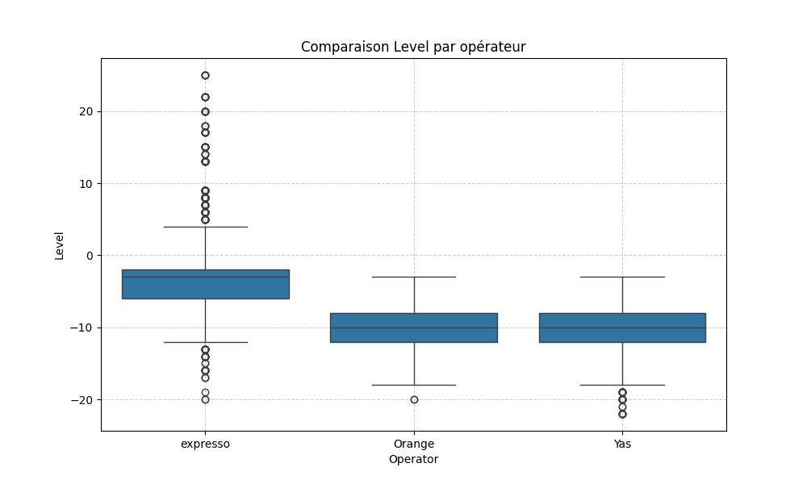

# GNetTrackAnalytics


---

## Description
**GNetTrackAnalytics** est un projet personnel visant à analyser les fichiers TXT générés par l’application **G-NetTrack Pro** lors de campagnes de mesures réseau mobile.

Le projet permet de :
- Nettoyer et structurer les fichiers TXT en CSV.
- Comparer la qualité radio (RSRP, SNR, CQI) pour différents opérateurs.
- Analyser les performances data (Download, Upload, Ping).
- Étudier les événements réseau (handovers, drop calls, failures).
- Générer des visualisations graphiques et un résumé global pour interprétation des résultats.

---

## Objectifs
- Créer un pipeline Python complet pour automatiser le traitement des données G-NetTrack Pro.
- Produire des analyses et des graphiques facilement interprétables.
- Manipuler et visualiser facilement les données pour des analyses réseau rapides.
- Faciliter l’évaluation de la QoS d’un réseau mobile à partir des fichiers logs bruts.

---

## Structure du projet
```
GNetTrackAnalytics/
├── raw_logs/                  # Fichiers TXT bruts de G-NetTrack Pro
├── processed/                 # CSV nettoyés et résultats
│   ├── graphs/                # Graphiques générés par les scripts
│   ├── *_clean.csv            # Données radio nettoyées
│   ├── *_datatest_clean.csv   # Données performance data nettoyées
│   ├── *_events_clean.csv     # Événements réseau nettoyés
│   ├── *_stats_clean.csv      # Statistiques intermédiaires
│   ├── resume_stats_events.csv
│   ├── resume_events_detail.csv
│   └── resume_global.csv      # Résumé global par opérateur
├── clean_txt_to_csv.py        # Nettoyage des fichiers TXT
├── plot_signal_quality.py     # Analyse et visualisation qualité radio
├── analyze_datatest.py        # Analyse et visualisation performance data
├── analyze_events.py          # Analyse événements réseau
├── plot_events.py             # Graphiques événements réseau
├── run_all.py                 # Orchestration complète du pipeline
├── .gitignore                 # Ignorer fichiers temporaires / CSV / graphs
└── README.md                  # Ce fichier
```

⚠️ Remarque : les chemins dans les scripts utilisent des **chemins relatifs**.  
Assurez-vous de conserver la structure des dossiers comme indiqué ci-dessus et de remplacer les chemins absolus par votre propre répertoire local si nécessaire.

---

## Installation
1. Cloner le repository :
```bash
git clone https://github.com/braz0101/GNetTrackAnalytics.git
cd GNetTrackAnalytics
```

2. Installer les dépendances Python :
```bash
pip install pandas matplotlib seaborn
```

3. Placer vos fichiers TXT G-NetTrack Pro dans le dossier `raw_logs/`.

---

## Utilisation
Exécuter le pipeline complet :
```bash
python run_all.py
```

Le pipeline effectue automatiquement :
1. Nettoyage des fichiers TXT → CSV (`clean_txt_to_csv.py`)  
2. Analyse qualité radio → graphiques (`plot_signal_quality.py`)  
3. Analyse performance data → graphiques (`analyze_datatest.py`)  
4. Analyse événements réseau → tableaux et graphiques (`analyze_events.py` + `plot_events.py`)  
5. Génération du résumé global (`resume_global.csv`)  

Tous les graphiques et fichiers finaux sont sauvegardés dans `processed/graphs/`.

---

## Exemple de sortie
Exemple de graphique généré :  


---

## Licence
Projet personnel. Scripts partagés sous licence **MIT**.  
Voir le fichier [LICENSE](https://github.com/braz0101/GNetTrackAnalytics/blob/main/LICENSE) pour plus de détails.

---

## Auteur
[Ibrahima FALL](https://github.com/braz0101) – Projet personnel de traitement et analyse des fichiers G-NetTrack Pro.

---

## Contribuer
Les contributions sont les bienvenues !  
Pour proposer des améliorations, créez un fork du dépôt, puis soumettez une pull request.
